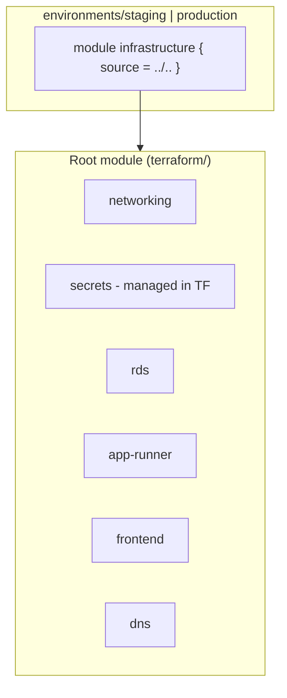
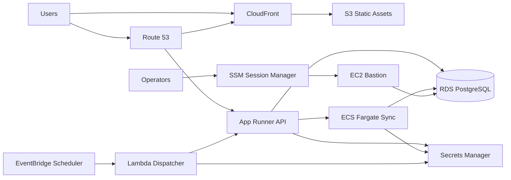

# Case Study: Rebuilding AWS Infrastructure with Terraform

> A personal account of taking over an early Terraform codebase, restructuring it for multi-environment operations, and evolving it into a secure, production-grade AWS platform.

---

## Executive Summary

When I inherited this infrastructure, Terraform already provisioned a full web application stack on AWS—but the layout optimized for a quick first deploy, not for long-term operations or security. Over the following weeks, I restructured the codebase around **environment roots** and **reusable modules**, externalized secrets, closed networking gaps, and established patterns that later supported remote state, least-privilege IAM, background jobs, and isolated batch compute.

This case study documents that journey: what the handover looked like, what I changed, and how the platform looks today—without tying the narrative to any single product or tenant.

---

## Tech Stack

| Layer | Technologies |
|-------|----------------|
| **IaC** | Terraform ≥ 1.5, AWS Provider ~5.x, `random` provider |
| **Compute** | AWS App Runner (API), ECS Fargate (long-running sync jobs), AWS Lambda (scheduled dispatch) |
| **Containers** | Amazon ECR, Docker images |
| **Data** | Amazon RDS for PostgreSQL (private subnets) |
| **Frontend delivery** | Amazon S3, Amazon CloudFront, ACM (certificates in `us-east-1` for CloudFront) |
| **Networking** | VPC, public/private subnets across AZs, Internet Gateway, NAT Gateway, security groups, App Runner VPC connector |
| **DNS & TLS** | Route 53, ACM (regional + `us-east-1` alias provider) |
| **Secrets** | AWS Secrets Manager (referenced, not committed) |
| **Scheduling** | Amazon EventBridge Scheduler, SQS dead-letter queue |
| **Observability** | Amazon CloudWatch Logs, ECS Container Insights |
| **Operations** | EC2 bastion via AWS Systems Manager Session Manager (no SSH keys), S3 + DynamoDB Terraform backend |
| **Governance** | AWS Service Catalog AppRegistry, consistent resource tagging |

---

## Phase 0: The Handover Baseline

The initial delivery proved the concept: modules for networking, RDS, App Runner, frontend (S3/CloudFront), DNS, and a secrets module that **created** Secrets Manager entries from Terraform.

### Architectural characteristics at handover



**What worked**

- Clear module boundaries per AWS service
- Staging and production entry points with environment-specific sizing (RDS class, App Runner CPU/memory)
- Documented S3 backend *example* for remote state
- Sensible default tags (`Environment`, `ManagedBy`, `Project`)

**What needed reform**

| Area | Handover state | Risk / friction |
|------|----------------|-----------------|
| **Layout** | Thin environment wrappers delegating to a monolithic root module | Hard to diverge staging vs production; root `main.tf` owned all wiring |
| **Secrets** | Terraform-managed secret resources | Secret *values* in state risk; rotation and ownership unclear |
| **Networking** | VPC without NAT; private subnets had no egress | App Runner / tasks in private subnets cannot reach external APIs (OAuth, webhooks, warehouse) |
| **Networking** | Hardcoded `10.0.0.0/16` in module | No per-environment CIDR flexibility |
| **DNS / TLS** | API pointed at default App Runner URL | No stable custom domain or certificate association workflow |
| **State** | Backend documented but not consistently adopted per environment | Local state risk on laptops |
| **RDS access** | No break-glass path to private database | Migrations and incidents blocked without broader network exposure |

The networking module even documented the intent explicitly: *“Simplified networking without NAT Gateway (not required for this deployment).”* That assumption broke down once the API needed outbound connectivity from private subnets.

---

## Phase 1: Environment-Centric Refactor (My First Reform)

**Goal:** Make each environment a first-class Terraform root—not a one-line wrapper around shared root configuration.

### 1.1 Split orchestration into environment roots

I moved providers, locals, variables, outputs, and module wiring into:

```
terraform/
├── modules/                    # Reusable building blocks (unchanged idea, improved inputs)
│   ├── networking/
│   ├── rds/
│   ├── app-runner/
│   ├── frontend/
│   ├── dns/
│   └── ...
└── environments/
    ├── staging/
    │   ├── main.tf
    │   ├── provider.tf
    │   ├── locals.tf
    │   ├── variables.tf
    │   ├── outputs.tf
    │   ├── dns.tf          # Records decoupled from modules
    │   └── secrets.tf      # Data-only secret references
    └── production/
        └── (same shape)
```

The root `terraform/main.tf` was retired from active use (commented orchestration only), so **plans and applies run from `environments/<env>/`**, aligning with how teams operate AWS accounts in practice.

### 1.2 DRY environment configuration

- **`locals.tf`**: `name_prefix`, FQDNs for frontend/API, production flag, shared tag map
- **`provider.tf`**: Primary region + aliased `us-east-1` provider for CloudFront certificates
- **Parameterized networking**: `vpc_cidr_block`, `availability_zones_count`, explicit public/private subnet CIDR lists with lifecycle preconditions ensuring subnet count matches AZ count

### 1.3 Staging parity

Staging received the same file layout as production so both environments could be validated with the same mental model—only tfvars differ (instance sizes, Multi-AZ, concurrency).

**Commit themes:** environment refactor, module parameterization, staging scaffold, region consolidation to `us-east-1`.

---

## Phase 2: Secrets and Security Posture

### 2.1 Secrets: from “Terraform creates” to “Terraform references”

I removed the active secrets *module* from the apply graph and introduced **`secrets.tf` per environment** using `data "aws_secretsmanager_secret"` lookups.

**Principles**

1. Secret **containers** are created out-of-band (CLI, console, or a dedicated secrets pipeline)—never checked into git.
2. Terraform only needs **ARNs** for IAM policies and runtime injection (App Runner, ECS task definitions).
3. A `secret_names` map in tfvars maps logical keys (`database_url`, `jwt_secret`, …) to fully-qualified secret names, enabling a namespace pattern like `{application}/{environment}/{key}` without hardcoding in modules.

Later, individual data sources were consolidated to `for_each` over a `local.secret_keys` list—reducing duplication as integrations grew (communications APIs, data warehouse credentials, alerting webhooks, email provider keys).

### 2.2 Least-privilege IAM at the module boundary

- **App Runner instance role**: `secretsmanager:GetSecretValue` scoped to `values(var.secrets)` only
- **ECS sync worker**: separate execution role (pull image, write logs, read secrets at start) vs task role (runtime secret access)—no blanket `*` on secrets
- **Scheduler Lambda**: dedicated role, Secrets Manager read for service-account JWT, SQS DLQ for failed invocations

### 2.3 Non-sensitive vs sensitive configuration

Operational settings (JWT expiry, Snowflake database/warehouse/schema names, frontend/backend URLs) are plain environment variables on App Runner; credentials remain in Secrets Manager. This keeps rotation and audit focused on the secrets plane.

**Commit themes:** wire App Runner and RDS to existing Secrets Manager secrets; drop `depends_on` the old secrets module.

---

## Phase 3: Production Networking and Edge Security

### 3.1 NAT Gateway for private egress

I added Elastic IP + NAT Gateway in a public subnet and routed `0.0.0.0/0` from the private route table through NAT. That unlocked:

- Outbound HTTPS from App Runner via VPC connector
- ECS Fargate tasks reaching external SaaS (warehouse, webhooks)
- Private RDS remaining unreachable from the internet

### 3.2 Custom domains and certificates

- **App Runner**: `aws_apprunner_custom_domain_association` with ACM validation records (documented two-step apply for certificate validation records when AWS ordering requires it)
- **CloudFront**: ACM in `us-east-1`, OAI/OAC-style origin protection for S3
- **Route 53**: Frontend `A` alias to CloudFront; API `CNAME` to App Runner custom domain target (stable target across service recreations)

### 3.3 Backend configuration hygiene

Remote state backend blocks were moved out of `versions.tf` into dedicated `backend.tf` per environment, separating **provider/version constraints** from **state storage config**—a small change that prevents accidental backend churn during provider upgrades.

**Commit themes:** NAT and private routing, App Runner custom domain outputs, DNS record wiring, backend file split.

---

## Phase 4: Operational Maturity (Building on the Foundation)

After the environment-centric core was stable, the codebase gained capabilities that represent a mature production platform. These build directly on the patterns above (module boundaries, secret references, private networking).

| Capability | AWS services | Design notes |
|------------|--------------|--------------|
| **Remote state** | S3, DynamoDB | Encrypted state, pessimistic locking, per-environment state keys |
| **Database access** | EC2 (ARM), SSM, security groups | Bastion with Session Manager port forwarding—no SSH keys, minimal SG (egress to RDS + SSM endpoints) |
| **Scheduled jobs** | EventBridge Scheduler, Lambda, SQS, Secrets Manager | Dispatcher Lambda calls HTTPS API; DLQ retains failures 14 days; scheduler-owned secrets created empty then populated manually |
| **Sync isolation** | ECS Fargate, ECR, CloudWatch | Long-running warehouse sync moved off the web tier; App Runner receives scoped `ecs:RunTask` only for designated task definition + cluster |
| **Observability** | AppRegistry, default tags | `awsApplication` tag links resources to a console application view |
| **Resilience** | App Runner auto scaling | `create_before_destroy` on scaling configuration; configurable `max_concurrency` |



---

## Module Design Today

Each module owns one concern and exposes outputs for composition:

| Module | Responsibility |
|--------|----------------|
| `networking` | VPC, subnets, IGW, NAT, route tables, connector-oriented security groups |
| `rds` | PostgreSQL, subnet group, security group, optional connection string write-back to Secrets Manager |
| `app-runner` | Service, VPC connector, IAM, auto scaling, custom domain, secret/env injection, optional ECS dispatch policy |
| `frontend` | S3 bucket policy, CloudFront distribution, ACM integration |
| `dns` | Hosted zone helpers, ACM for API and frontend |
| `bastion` | SSM-enabled jump host for RDS port forwarding |
| `scheduler` | EventBridge rules, Lambda package, IAM, DLQ, scheduler secrets |
| `sync-worker` | ECS cluster, task definition, scoped IAM, RDS SG rule |

Environment `main.tf` files read as an **ordered composition** with explicit `depends_on` where AWS ordering matters (RDS before App Runner; App Runner before scheduler).

---

## Environment Strategy

| Concern | Approach |
|---------|----------|
| **Isolation** | Separate Terraform state per environment (distinct S3 keys) |
| **Configuration** | `terraform.tfvars` per environment; example files in repo, secrets never committed |
| **Promotion** | Same module sources; differ sizing, Multi-AZ, concurrency, and secret name prefixes |
| **Apply surface** | Operators `cd environments/<env>` then `plan` / `apply`; optional CLI wrappers for init and namespace-aware secret sync |

Production is the actively deployed target; staging retains structural parity for drift detection and future reactivation.

---

## Lessons Learned

1. **Optimize the Terraform layout for the team, not for a tutorial.** A root wrapper module is concise but fights real-world divergence between environments.
2. **Treat secrets as external dependencies.** Data sources + IAM scoping beat `aws_secretsmanager_secret` resources in application Terraform.
3. **Question “simplified” networking.** Missing NAT is cheaper until any private compute needs the public internet—then it becomes a production blocker.
4. **Decouple DNS records from service modules.** `dns.tf` at the environment layer breaks circular dependencies (CloudFront ↔ hosted zone ↔ App Runner validation).
5. **Invest early in remote state and break-glass access.** S3/DynamoDB locking and SSM bastions pay off during incidents and migrations.
6. **Split batch from web compute before scale bites.** ECS Fargate with narrowly scoped IAM scales sync work without enlarging the API blast radius.
7. **Tag for ownership.** AppRegistry + `Component` tags make cost and ownership visible in the console.

---

## Timeline (Git History)

| Period | Focus |
|--------|--------|
| **Handover** | Initial modules, root orchestration, staging/production wrappers, CI/CD hooks |
| **Week 1 (reform)** | Environment-first layout, secret data sources, parameterized VPC, staging scaffold |
| **Week 2 (edge + network)** | NAT Gateway, custom domains, DNS for API/frontend/email auth, backend config split |
| **Following months** | S3 remote state, SSM bastion, EventBridge scheduler, ECS sync worker, secret `for_each`, AppRegistry, operational hardening |

---

## Results

- **~3,500+ lines** of Terraform evolution from handover to current tree (modules + environments), with the root monolith retired in favor of environment roots.
- **Zero secret values** in version control; ARN-only references with namespace-configurable names.
- **Private-by-default data plane** with controlled egress and operator access via SSM.
- **Extensible job platform** (scheduler + optional Fargate workers) without redeploying the API for every background concern.

---
